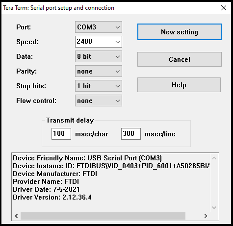
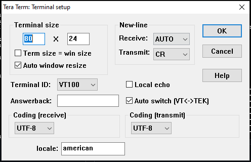
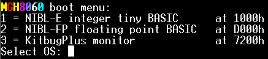

The main firmware file (MGH8060_300124.hex) consists of 3 projects:

* National Industrial Basic Language (NIBL)
* NIBL with floating point extension
* Kitbug+ monitor

Connect to the device using one of the serial ports (RS232 or USB-to-TTL adapter), you should be using 2400 baud, 8-bit data, no parity, and one stop bit. The SC/MP is not fast enough to process at 2400 so you need to add a delay between characters and at the end of the line, here are my settings for the popular Tera Term program on Windows:

You may also want to adjust the "Terminal settings":

When you reset the board, a menu will be presented, select by pressing 1, 2 or 3:

There are also a few demo programs that can be uploaded via Kitbug+ "S" command and executed with the "G" command (filename indicates the upload and execution address)
| Filename | Description |
| :--: | :--: |
|fade_led_x6400.bin ||
|flash_led_x6000.bin ||
|life_x6800_jc.bin ||
|scmp_sine_0x6800.bin ||
|scmp_xmas2023_0x2800.bin ||
|xmasstar_x4800.bin ||

## Big thanks to "Retro Phil" who has been maintaining the Kitbug+ firmware and adapted it to the new memory mapping on this PCB, he has also created the "selection menu" for MGH8060... you can follow his adventures with SC/MP on his [page](https://www.mccrash-racing.co.uk/philg/picl/picl.htm).
