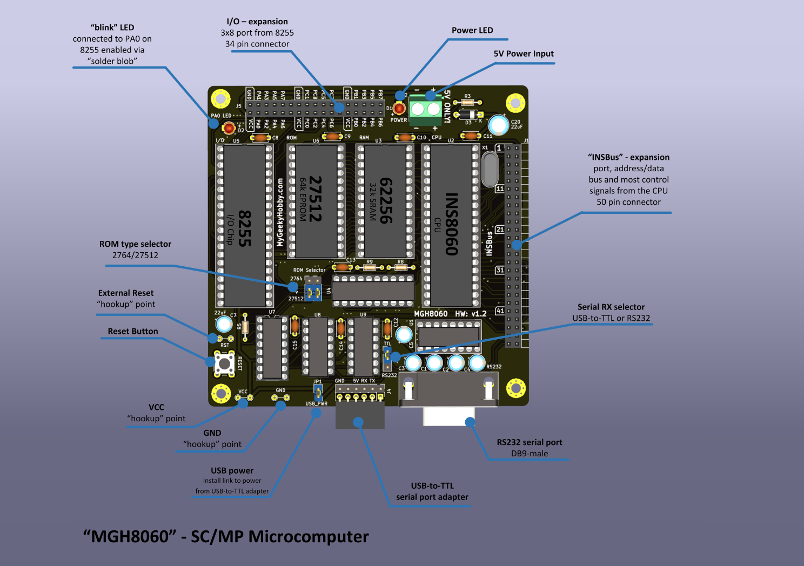
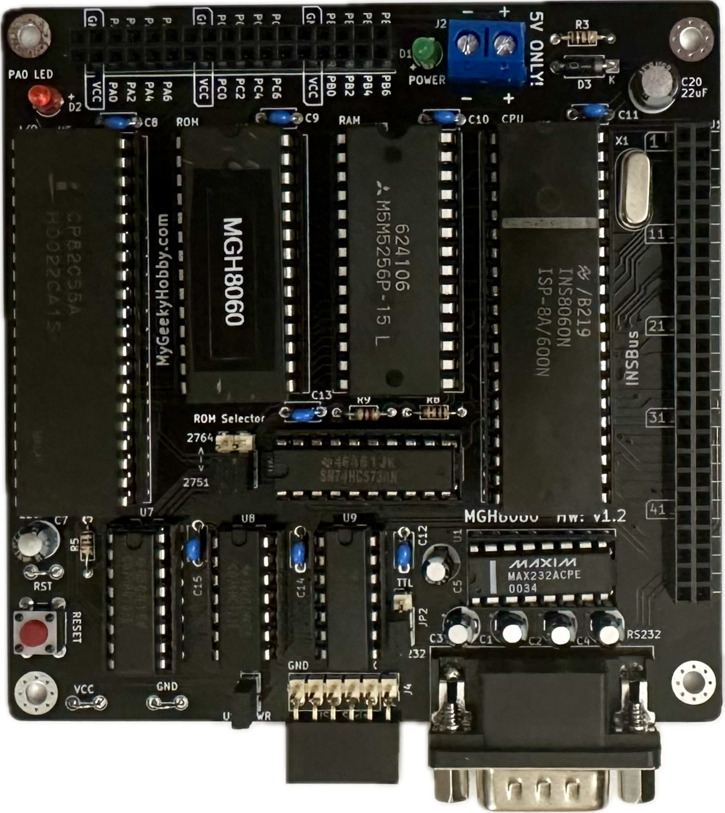

# MGH8060
SC/MP INS8060-based microcomputer running National Industrial Basic Language (NIBL)

Here is an overview of the device:

And here is my assembled unit - hardware v1.2

## Bill of Materials

| Component type     | Reference | Description                                   | Quantity |
| ------------------ | --------- | --------------------------------------------- | -------- |
| PCB                |           | [Order from PCBWay](https://www.pcbway.com/project/shareproject/MGH8060_SC_MP_Microcomputer_731c2144.html)| 1        |
| Integrated Circuit | U1        | MAX232(A) - RS232 Driver, 16 pin DIP          | 1        | 
| Integrated Circuit | U2        | INS8060 - SC/MP II Microcontroller, 40 pin DIP    | 1        |
| Integrated Circuit | U3        | HM62256B - 32kb SRAM, 28 pin DIP    | 1        |
| Integrated Circuit | U4        | 74LS573 - high-speed octal latch, 20 pin DIP    | 1        |
| Integrated Circuit | U5        | 8255A - Programmable Peripheral Interface, 40 pin DIP    | 1        |
| Integrated Circuit | U6        | 27C512 - 64kb EPROM, 28 pin DIP    | 1        |
| Integrated Circuit | U7        | 74LS138 - 3-to-8 line decoder, 16 pin DIP    | 1        |
| Integrated Circuit | U8        | 74LS21 - Dual 4 -Input AND Logic, 14 pin DIP   | 1        |
| Integrated Circuit | U8        | 74LS04 - HEX Inverter, 14 pin DIP   | 1        |
| LED                | D1        | LED indicator, 3 mm                           | 1        |
| LED                | D2        | LED indicator, 3 mm                           | 1        |
| Diode                | D3        | 1N4002,  general-purpose diode    | 1        |
| Pin Header         | J1        | 2x17 header female, 2.54 mm pitch        | 1        |
| Connector         | J2        | Screw terminal        | 1        |
| Connector         | J3        | DB9 male        | 1        |
| Pin Header         | J4        | 1x6 pin header, 2.54 mm pitch, angle | 1 |
| Pin Header         | J5        | 2x25 header female, 2.54 mm pitch        | 1        |
| Pin Header         | J6        | 1x6 pin header, 2.54 mm pitch | 1 |
| Pin Header         | JP1        | 1x2 pin header, 2.54 mm pitch | 1 |
| Pin Header         | JP2-JP4        | 1x3 pin header, 2.54 mm pitch | 1 |
| Capacitor          | C8-C15   | 1 uF, 16V, electrolytic, 2.54 mm pitch                  | 5       |
| Capacitor          | C6       | 27pF, ceramic, 2.54 mm pitch                | 1        |
| Capacitor          | C8-C15   | 0.1 uF, 50V, MLCC, 5 mm pitch                 | 8        |
| Capacitor          | C7,C20   | 22uF, 6.8V, electrolytic, 2.54 mm pitch                | 1        |
| Resistor           | R1   | 160 kohm, 0.125 W, axial                       | 1        |
| Resistor           | R2-R4   | 1 kohm, 0.125 W, axial                       | 4        |
| Resistor           | R5   | 10k kohm, 0.125 W, axial                       | 1        |
| Resistor           | R9   | 4.7k kohm, 0.125 W, axial                       | 1        |
| Crystal           | X1   | 4MHz, short 3.5mm heigh max                       | 1        |
| IC Socket          | U8,U9     | 14 pin DIP                                    | 1        |
| IC Socket          | U1,U7    | 16 pin DIP                                    | 1        |
| IC Socket          | U4     | 20 pin DIP                                    | 2        |
| IC Socket          | U3,U6     | 28 pin DIP                                    | 2        |
| IC Socket          | U2,U5     | 40 pin DIP                                    | 2        |

## Release Notes

I used HCT parts for most of the ICs. Power usage was about 60mA

I used Winbond W27C512 (EEPROM pin compatible with EPROMs)

Please consider getting the PCB from my sponsor PCBWay

If you found this helpful and you like the work I do, why not buy me a coffee, thanks! :)

### Schematic
[Schematic - Version 1.2](Hardware/mgh8060_v1.2.pdf)

### Changes
* Version 1.2:
  
  * Fixed missing connections. 

* Version 1.1:
  
  * Corrected CE signals (thanks Phil)

* Version 1.0
  
  * Initial version

## License

Copyright 2024 Kris Sekula

This work is licensed under a [Creative Commons Attribution-NonCommercial 4.0 International (CC BY-NC 4.0) ](https://creativecommons.org/licenses/by-nc/4.0/).

### Trademarks

* Other names and brands may be claimed as the property of others.
